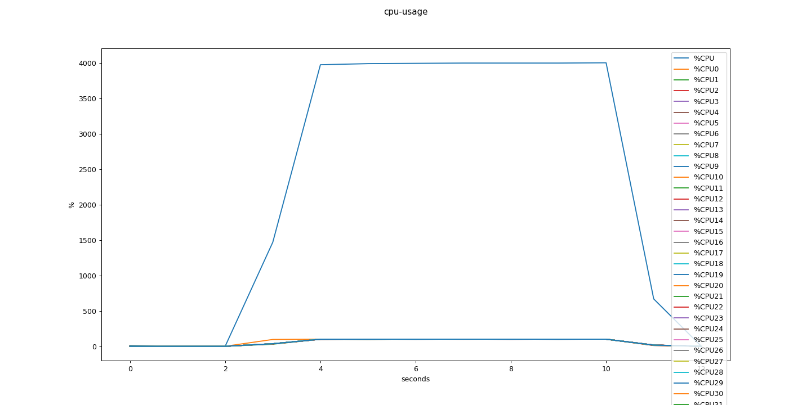
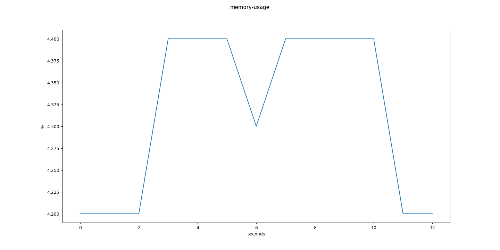
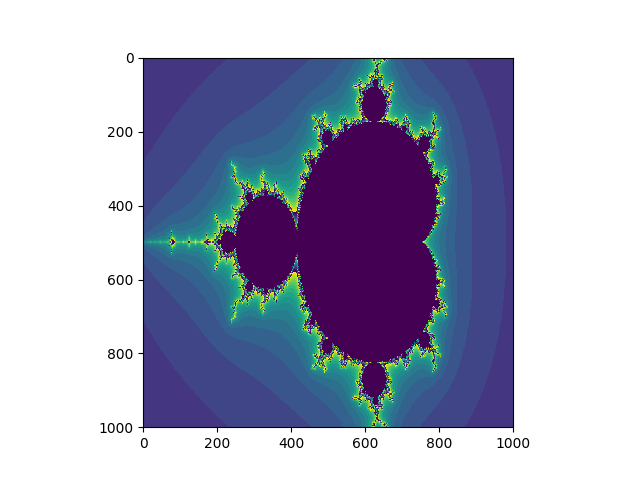
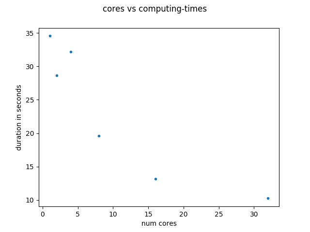
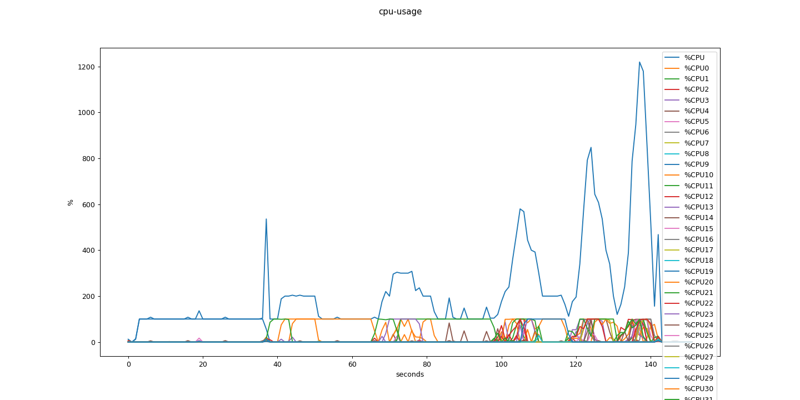
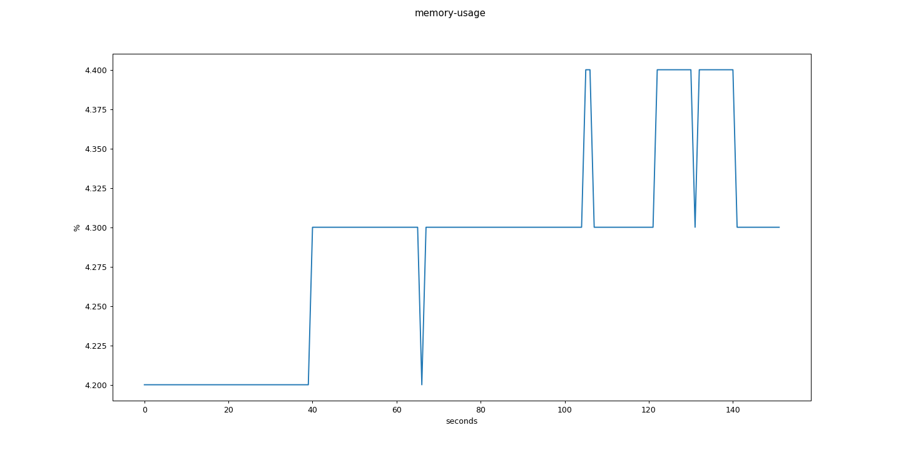
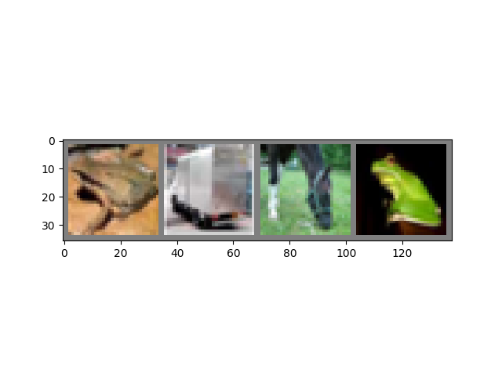
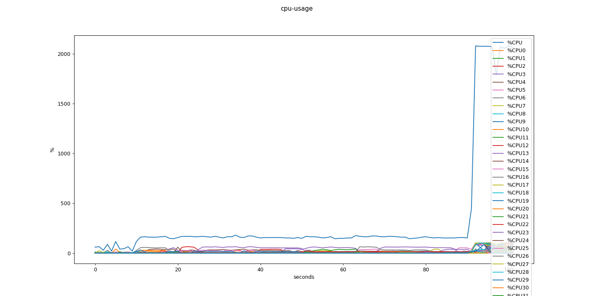
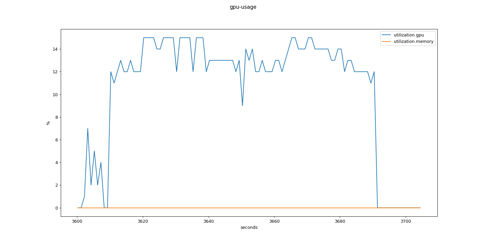
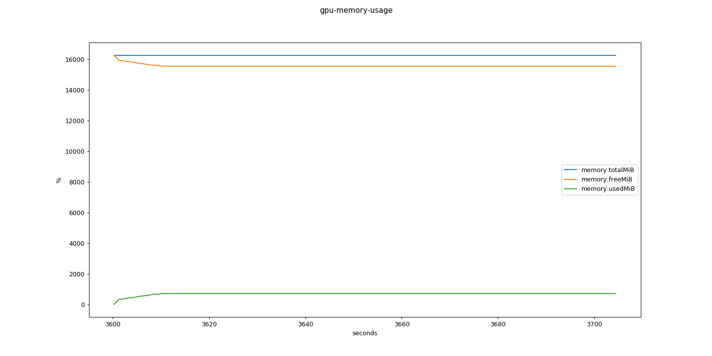

# computing on TUB's HPC (High Performance Cluster)
## links
`https://hpc.tu-berlin.de/doku.php`  
`https://hpcc.usc.edu/support/documentation/`  
`https://hpc.uni.lu/users/docs/slurm_examples.html`

## access-rights
Tobias magically makes that you're granted permissions

## hardware on the cluster
(see: https://hpc.tu-berlin.de/doku.php?id=hpc:hardware)
* 132x MPP-Nodes with 40 threads, 256 GB memory
* 20x GPU-Nodes with 40 threads, 512 GB memory, 2x NVIDIA Tesla P100 16GB

## ssh the frontend/gateway  
first give gateway your public ssh key  
`ssh-copy-id -i ~/.ssh/id_rsa.pub <TUBIT_NAME>@gateway.hpc.tu-berlin.de`  
log onto the gateway  
`ssh <TUBIT_NAME>@gateway.hpc.tu-berlin.de`  

#### give gitlab your public gateway key  
manually copy this `cat ~/.ssh/id_rsa.pub`  

#### mount the gateway/frontend to your local system  
`sshfs <TUBIT_NAME>@gateway.hpc.tu-berlin.de:/home/users/t/<TUBIT_NAME> ~/hpc`  

## copy files to gateway
* rsync  
`rsync -aP --exclude=.git ~/some_folder ~/hpc`
* scp    
`scp -r /local/directory/ <TUBIT_NAME>@gateway.hpc.tu-berlin.de:/home/users/t/<TUBIT_NAME>/`
* filezilla  
`https://hpcc.usc.edu/support/documentation/transfer/computer-to-hpc/`

## some useful SLURM-commands
interactive session on node:
`srun -A qu -t 30 -c 40 -n 1 --pty /bin/bash`
* __A__ ccount=qu (somehow for me it also works without this)
* max run- __t__ ime = 30 min
* __c__ ores = 40
* __n__ odes = 1
* __pty__ makes it interactive   

interactive session with __GPU__:  
`srun -A qu -t 30 -c 40 -n 1 --gres=gpu:tesla:1 -p gpu --pty /bin/bash`  

status of jobs: `squeue`  
shows your account-type: `sacctmgr show user <TUBIT_NAME> accounts`    

## setup python environment on gateway
get miniconda  
`wget https://repo.anaconda.com/miniconda/Miniconda3-latest-Linux-x86_64.sh`  
install conda: `bash Miniconda3-latest-Linux-x86_64.sh`  
clone it: `git clone git@gitlab.tubit.tu-berlin.de:tilo-himmelsbach/hpc-computing.git`
cd: `cd hpc-computing`
create environment: `conda create -n hpc-tutorial python=3.7`  
activate environment: `conda activate hpc-tutorial`  
install dependencies: `pip install -r requirements.txt`
## monitoring example
#### interactive 
open interactive session  
`srun -A qu -t 30 -c 40 -n 1 --pty /bin/bash`  
`source activate hpc-tutorial`  
or  
`~/miniconda/bin/conda activate hpc-tutorial`  
`python monitoring_example/monitor_matrix_multiplications.py`
#### batch
run hpc_job.sh with sbatch-command  
give environment name `hpc-tutorial` as argument to `hpc_job.sh`  
give .py-file as second argument to `hpc_job.sh`  
`sbatch hpc_job.sh hpc-tutorial monitoring_example/monitor_matrix_multiplications.py`
do some numpy matrix multiplications notice that numpy uses all 40 cores (4000% usage)

memory usage is around 4.3%

## multiprocessing example
calculate mandelbrot-set  

-> this formula produces chaos == makes it unpredictable whether or not abs(z) converges or diverges after n-iterations; 
this chaotic behavior justifies a parallel computing -> no GPU even though its an image!

#### the more cores the faster  
  
#### cpu-usage over time

## pytorch-image-classifier-example
frog; truck; horse; frog  
  

#### interactive
on gateway  
`python pytorch_image_classifier_example/download_data.py`  
on GPU-node  
`srun -A qu -t 30 -c 40 -n 1 --gres=gpu:tesla:1 -p gpu --pty /bin/bash`  
`cd hpc-computing`  
`source activate hpc-tutorial`  
`python python pytorch_image_classifier_example/cifar10_tutorial.py `  
cpu-usage: towards the ends it high cause evaluation is done on CPUs not on GPUs!
  
gpu-usage: around 14%

gpu-memory-usage: some error in plot: y-axis displays MiB not percentage!!

